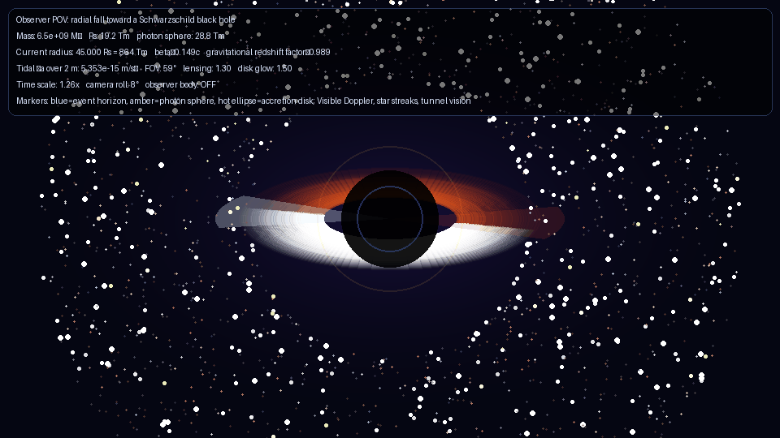
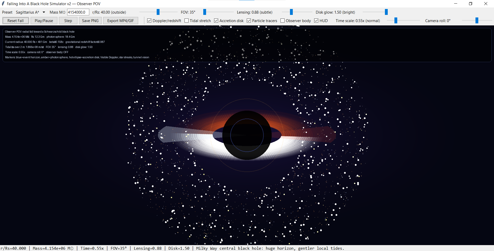

# Falling Into a Black Hole

> Experience what falling into a black hole might feel like — from a first-person observer’s point of view.



A Tkinter-based educational black hole simulator focused on **observer POV immersion**, gravitational lensing, Doppler/redshift effects, accretion disks, tidal stretching and cinematic visualization.

This project explores what **falling toward a Schwarzschild black hole** might *feel like* visually from the perspective of the observer.

**Important:** This is an educational real-time simulator — **not** a full general-relativistic ray tracer.

---

## Features

### Observer POV Simulation

- First-person fall toward a Schwarzschild black hole
- Observer-perspective immersion
- Observer body mode:
  - hands
  - legs
  - visor overlay
  - tidal stretching visualization

### Physics-Inspired Visualization

- Schwarzschild radius (`Rs`) calculation
- Event horizon marker
- Photon sphere marker (`1.5 Rs`)
- ISCO reference (`3 Rs`)
- Approximate gravitational lensing / Einstein-ring effect
- Approximate gravitational redshift
- Visible Doppler / relativistic beaming effect
- Accretion disk rendering
- Star streaking during close approach
- Tunnel vision / gravitational vignette near the horizon
- Tidal stretching / spaghettification approximation

### Interactive Controls

- `r/Rs` control (distance to event horizon)
- Camera FOV slider
- Camera roll slider
- Time scale control
- Lensing intensity
- Disk glow control
- Observer body toggle
- Doppler/redshift toggle
- Particle tracers toggle
- Tidal stretching toggle

### Presets

- Stellar black hole (`10 M☉`)
- Sagittarius A*
- M87*

### Export

- PNG export
- MP4/GIF export

---

## Screenshots

### UI & Controls



---

## Installation

### Create environment

```bash
conda create -n blackhole-simulator python=3.12 pip tk -y
conda activate blackhole-simulator
pip install -r requirements.txt
```

### Run

```bash
python blackhole_tk.py
```

---

## Controls & Notes

### `r/Rs`

The ratio:

```text
r / Rs
```

Where:

- `r` = current distance from the black hole center
- `Rs` = Schwarzschild radius

Interpretation:

| Value | Meaning |
|---:|---|
| 20+ | Far away / weak lensing |
| 10 | Distortion becomes visible |
| 6 | Strong spacetime warping |
| 3 | Near photon sphere |
| 2 | Extreme visual distortion |
| 1.0 | Event horizon |

---

### Time Scale

Controls perceived simulation speed.

Examples:

| Value | Feel |
|---:|---|
| 0.20x | cinematic / immersive |
| 0.50x | slow exploration |
| 1.00x | normal |
| 2.00x | fast demo |

---

### Lensing Levels

| Range | Meaning |
|---|---|
| subtle | mild spacetime distortion |
| strong | clearly visible lensing |
| extreme | highly dramatic visuals |

---

### Observer Body Mode

Observer body mode is intentionally interpretive.

It attempts to make the experience feel:

> first-person, immersive and educational

rather than physically exact.

Hands, legs, visor and body stretching are stylized visual approximations of tidal effects.

---

### Doppler / Redshift

When enabled:

- approaching regions become brighter / bluer
- receding regions become redder / dimmer

This is an educational approximation of relativistic beaming and Doppler shift.

---

## Physics Caveat

This simulator uses real formulas where cheap, stable and visually useful:

- Schwarzschild radius:

```text
Rs = 2GM / c²
```

- Photon sphere:

```text
1.5 Rs
```

- ISCO:

```text
3 Rs
```

- Gravitational redshift:

```text
sqrt(1 - Rs/r)
```

- Approximate tidal acceleration:

```text
2GM L / r³
```

Many visual effects (especially inside/near the horizon) are **interpretive approximations** designed for intuition, performance and interactive rendering.

---

## Example Use Cases

- Educational astrophysics demos
- Visualization experiments
- Portfolio project
- Relativity intuition building
- Sci-fi inspired exploration
- Cinematic black hole rendering

---

## Roadmap

### v3 ideas

- Schwarzschild geodesic ray tracing
- Kerr black hole spin parameter (`a`)
- Real celestial sphere textures
- Improved relativistic aberration
- Better Doppler beaming model
- Disk temperature / black-body colors
- JSON preset export/import
- Modular architecture

```text
physics.py
renderer.py
ui.py
export.py
```

---

## Repository Structure

```text
falling-into-a-black-hole/
│
├── blackhole_v2_tk.py
├── requirements.txt
├── README.md
├── LICENSE
│
└── outputs/
```

---

## Why this project?

Most black hole visualizations focus on:

> observing a black hole from the outside

This project explores:

> **What falling into one might feel like from the observer’s perspective.**